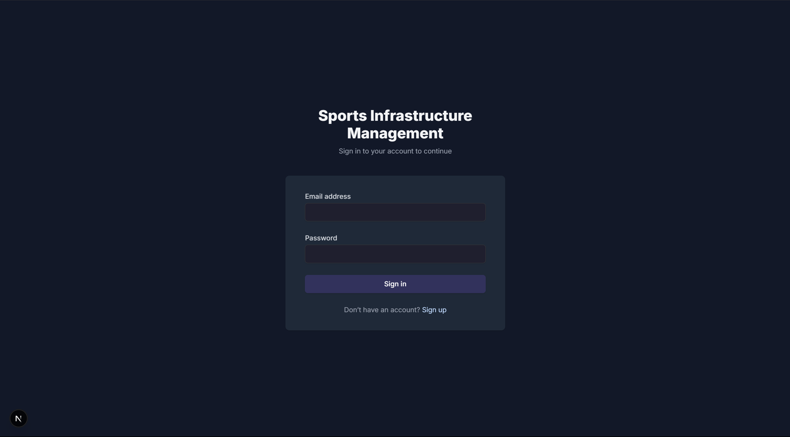
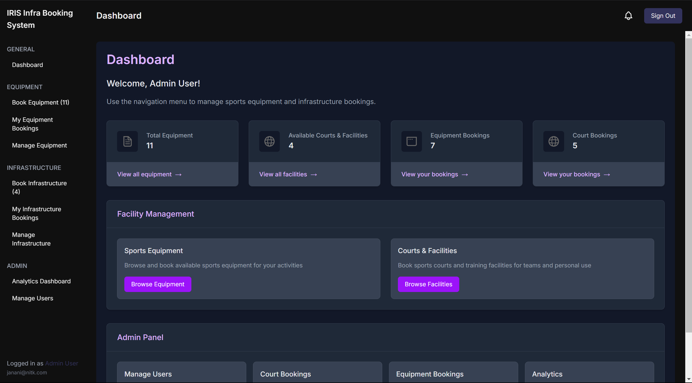
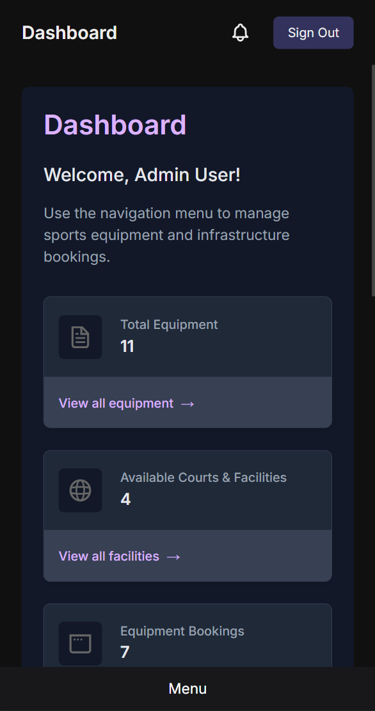
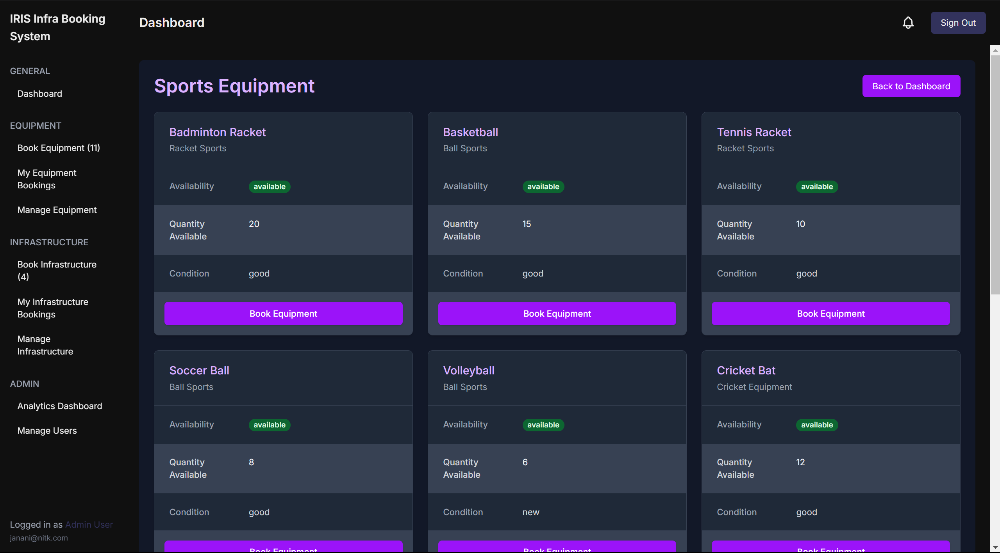
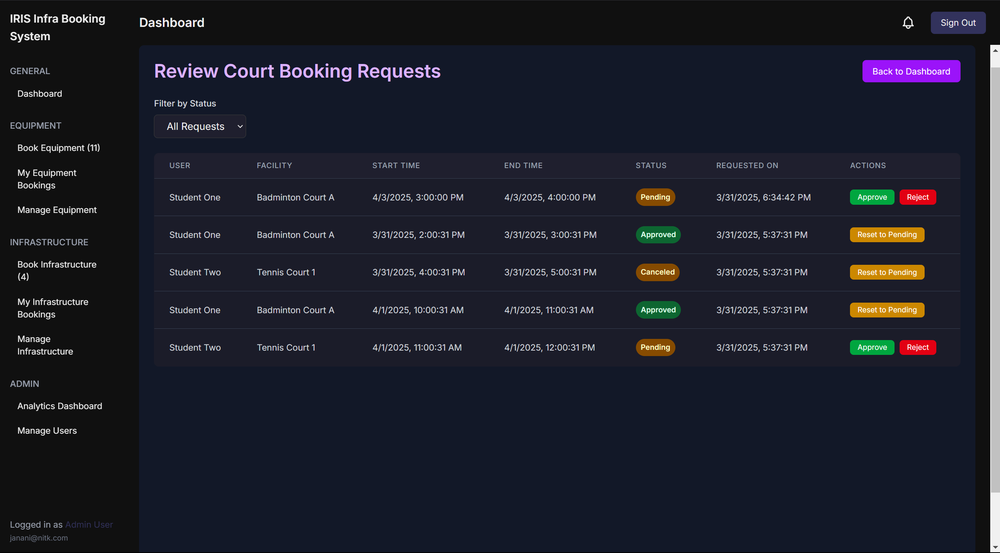
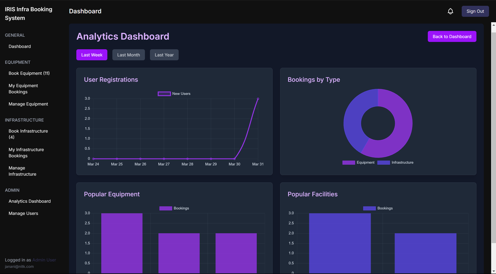

# Sports Infrastructure Management System

This project is a web-based platform designed to streamline the management of sports equipment and infrastructure at NITK. It provides a seamless experience for students and admins to book, manage, and track sports facilities and equipment.

### Installation + Demo Run video

[DemoVideo](IRIS_WebRecs2025_231IT054.mp4)

<video src="IRIS_WebRecs2025_231IT054.mp4" controls width="600"></video>

## Implemented Features

### Equipment Management

- **Add/Update Equipment**: Admins can add new equipment (e.g., cricket bats, footballs) and update their availability, condition, and quantity.
- **Request Equipment**: Students can request equipment by specifying the quantity and duration.
- **Approval Process**: Admins can approve or reject equipment requests with comments.
- **Tracking**: Students can track the status of their requests.

### Infrastructure Booking

- **View Availability**: Students can check real-time availability of sports facilities (e.g., badminton courts).
- **Book Facilities**: Students can book facilities for specific time slots.
- **Admin Approval**: Admins can approve or reject booking requests.
- **Notifications**: Students receive updates on booking status and reminders before their slot.

### Bonus Features (Implemented In App)

- **In depth Analytics Dashboard**: Admins can view usage trends, peak booking hours, and most booked equipment.

### Planned Features:

- **User Deletion by Admin**

## Technologies Used

- **Frontend**: React, Next.js
- **Backend**: Node.js, Express.js
- **Database**: MongoDB
- **Authentication**: NextAuth.js
- **Styling**: Tailwind CSS

## Known Bugs

- Non-admin users were previously unable to view equipment. This issue has been fixed.
- No other major bugs reported.

## Getting Started

### Prerequisites

- Node.js and npm installed on your system.

### Installation

1. Clone the repository:
   ```bash
   git clone https://github.com/rsmyst/IRIS_Web_Rec25_231IT054.git
   ```
2. Navigate to the project directory:
   ```bash
   cd IRIS_Web_Rec25_231IT054
   ```
3. Install dependencies:
   ```bash
   npm install
   ```
   Create .env file
4. Seed Data (for testing purposes including test accounts):
   ```node
   node scripts/seed.js
   ```

### Running the Development Server

Start the development server:

```bash
npm run dev
```

### Screenshots:








Also, ensure MongoDB service is running in the background.

Open [http://localhost:3000](http://localhost:3000) in your browser to view the application.
